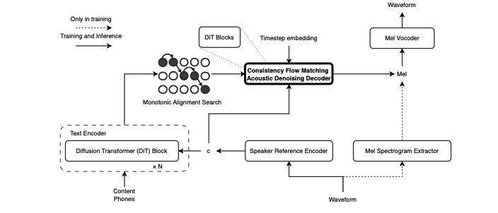

# StableTTS_ConsistFM

**StableTTS: Towards Efficient Denoising Acoustic Decoder for Text to Speech Synthesis with Consistency Flow Matching (ICASSP25)**



- [x] Demonstration Page
- [x] StableTTS-ConsistFM Code for ICASSP paper experiments
- [x] StableTTS-ConsistFM Weights

StableTTS (Consistency Flow Matching): Code and other materials for the ICASSP25 paper are being updated in this repository.

Our backbone StableTTS is available in the [DIT-OTCFM repository](https://github.com/KdaiP/StableTTS) (maintained by our research group).

## DEMO

Visit our demonstration page:  
https://zhiyongchengreat.github.io/stabletts_ccfm

## Training

For first stage training (with boundary == 0):

```
python StableTTS_24k/train.py
```

Then, perform second stage training with the consistFM boundary. Continue from the first stage checkpoint and further train with consistFM:

```
python StableTTS_24k/train_bd.py
```


## Inference

We provide checkpoints for both first stage and second stage training of StableTTS with consistency flow matching. This includes:
- Checkpoints for the baseline model trained with the same architecture using gradTTS, MatchaTTS, and VoiceFlow style loss.
- Vocoder parameters.

Access all weights and baseline weights here:  
[](https://huggingface.co/zhiyongchen/StableTTS_consistfm/tree/main)

The vocoder weight is available here:  
[](https://huggingface.co/zhiyongchen/StableTTS_consistfm/tree/main)


For inference, please refer to:  
```
inference_stableTTS.ipynb
```

## Reference and Citations

For any inquiries or further information, please contact:

- zhiyongchen@shu.edu.cn  
- zhiyongchen2021@gmail.com
